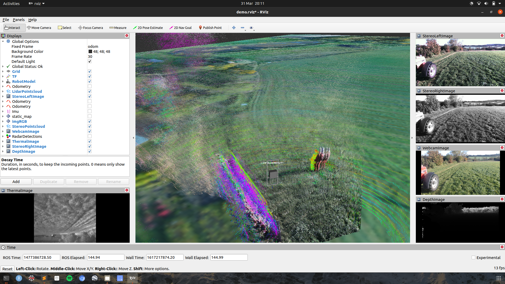

# Task Description

Develop a ROS package that detects people and maps their locations. You are free to utilise appropriate data fusion algorithms, ROS packages and opensource libraries as you see fit. It is worth considering that downstream of your mapped locations would be a path planner that takes action to avoid the people, but we are leaving it up to you as to how you choose to represent the people and their locations.

You have seven days to do this, after which you should share a link to a Git repo with your solution for Kingdom to review. We will then organise an hours video call so that you can talk us through your solution and the decisions you made.

## Data Provided

The data provided is taken from the [FieldSafe](https://vision.eng.au.dk/fieldsafe/). Sensor specifications, ground truth information and ROS environment details are all provided on the page.

We have trimmed down the first 147 sec of "Static obstacle session #1" for you and made it available [here](GOOGLEDRIVE) (14.9 GB).




We have forked their [original Git repo](https://github.com/mikkelkh/FieldSAFE#installation-instructions) in order to correct some issues we encountered and to bring it forward to working with **ROS Noetic** on **Ubuntu 20.04**. Please use the **final_task** branch and follow the installation instructions below.

The datasets as provided from the FieldSafe page have issues with some of the frame ids. Kingdom have created a script that you can use to rectify the issue, should you choose to use any of the alternate datasets. 

To use it follow these steps:

* Edit the mod_frame_id.py script in **/path/to/FieldSAFE/ros/src/demo/scripts/** to have the correct paths for your system

* Run the frame_id modifier
    ```sh
    python3 /path/to/FieldSAFE/ros/src/demo/scripts/mod_frame_id.py
    ```

## FieldSAFE - Dataset for Obstacle Detection in Agriculture

[](https://www.youtube.com/watch?v=YXz1zdaFX0E)

This repository contains the necessary software for utilizing the FieldSAFE dataset.
Software and example usage scripts are available in the folder "ros".
Further, ground truth GPS annotations for all static and dynamic obstacles are contained in the folder "ground_truth".

For more information, visit the FieldSAFE website: [https://vision.eng.au.dk/fieldsafe/](https://vision.eng.au.dk/fieldsafe/)

### Citation
If you use this dataset in your research or elsewhere, please cite/reference the following paper:

[FieldSAFE: Dataset for Obstacle Detection in Agriculture](https://arxiv.org/abs/1709.03526)

```sh
@article{kragh2017fieldsafe,
  title={FieldSAFE: Dataset for Obstacle Detection in Agriculture},
  author={Kragh, Mikkel Fly and Christiansen, Peter and Laursen, Morten Stigaard and Larsen, Morten and Steen, Kim Arild and Green, Ole and Karstoft, Henrik and J{\o}rgensen, Rasmus Nyholm},
  journal={arXiv preprint arXiv:1709.03526},
  year={2017}
}
```

## Modified Installation Instructions from Kingdom
The FieldSAFE dataset and software has been tested with Ubuntu 20.04 and ROS Noetic, but may work with other Linux and ROS distributions.
Below, installations instructions for all necessary dependencies are given.

* Install ROS Noetic on Ubuntu 20.04 (Desktop-Full Install)

    http://wiki.ros.org/noetic/Installation/Ubuntu

* Install the following additional packages:
    ```sh
    sudo apt-get install ros-noetic-robot-localization 
    sudo apt-get install ros-noetic-geographic-msgs
    sudo apt-get install libpcap-dev
    ```
* Clone and build this repository
    ```sh
    git clone https://github.com/kingdomtechnologies/FieldSAFE.git
    cd FieldSAFE
    git checkout -B final_task
    git submodule update --init --recursive
    cd ros
    catkin_make
    ```
* Environment Setup
    ```sh
    source devel/setup.bash
    ```
* Download the prepared bag with sensor data: 

    [2016-10-25-11-09-42_trimmed.bag](GOOGLEDRIVE) 14.9 GB

* Run the original demo
    ```sh
    roslaunch demo demo.launch file:=/path/to/2016-10-25-11-09-42_trimmed.bag
    ```
